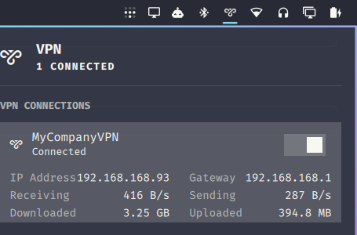

# Omarchy VPN Plugin

A first-party-styled OpenVPN widget for the [Omarchy](https://omarchy.org/) status bar. Import a `.ovpn` profile and connect, disconnect, and monitor it without leaving the bar — no manual `nmcli`/NetworkManager setup required.



## Features

- **One-click `.ovpn` import** via NetworkManager (`nmcli connection import type openvpn`) — no manual config editing.
- **Username/password prompt** inline in the panel for profiles that need `auth-user-pass` credentials; an optional **Remember password** toggle saves it to the system keyring (libsecret / gnome-keyring) so later connects skip the prompt.
- **Split tunnel on import** (on by default): the import options include a toggle that sets the new profile so only its own routes use the VPN, while internet traffic and DNS stay on your normal network. NetworkManager's importer ignores `pull-filter ignore "redirect-gateway"`, so without this an imported profile becomes the default route.
- **Wi-Fi-style on/off toggle** to connect and disconnect each imported profile.
- **Live connection details** — IP address, gateway, current throughput, and total bytes transferred — in the same layout as Omarchy's built-in Network panel.
- **Multiple profiles** — import and manage more than one `.ovpn` connection from the same widget.
- Built entirely from Omarchy's native `qs.Ui` / `qs.Commons` components, so it matches the system theme (light/dark, accent color, corner radius) automatically.

## Requirements

- Omarchy (Quattro shell) on Arch Linux.
- `networkmanager-openvpn` (provides the NetworkManager OpenVPN plugin used for import/connect):

  ```bash
  sudo pacman -S networkmanager-openvpn
  ```

- A user account with NetworkManager permission to import and activate VPN connections without a privilege prompt. This is Omarchy's stock configuration; verify with:

  ```bash
  nmcli general permissions | grep vpn
  ```

## Install

```bash
omarchy plugin add https://github.com/srlinuxme/omarchy-vpn-plugin.git --enable
```

This clones the plugin into `~/.config/omarchy/plugins/srlinux.vpn/`, enables it, and adds its icon to the bar.

If the icon doesn't appear immediately, force a full shell restart (plugin *code* hot-reloads, but a brand-new bar widget needs the shell process itself to restart once):

```bash
omarchy restart shell
```

### Manual install

```bash
git clone https://github.com/srlinuxme/omarchy-vpn-plugin.git ~/.config/omarchy/plugins/srlinux.vpn
omarchy plugin enable srlinux.vpn
omarchy restart shell
```

## Usage

1. Click the VPN icon in the bar (shield/mullvad-style glyph, next to Network/Bluetooth).
2. Click **+ Import .ovpn** and pick your `.ovpn` file.
3. If the profile requires a username and password, a form appears inline — enter your credentials and connect.
4. Once connected, use the toggle switch next to the profile name to disconnect/reconnect. IP address, gateway, and live transfer stats appear below the profile while it's active.
5. Use the small remove (×) control, shown on hover, to delete a profile you no longer need.

## Uninstall

```bash
omarchy plugin disable srlinux.vpn
rm -rf ~/.config/omarchy/plugins/srlinux.vpn
```

This does **not** remove any NetworkManager VPN connections you imported; those are ordinary NetworkManager profiles. Remove them separately if desired:

```bash
nmcli -t -f NAME,TYPE connection show | grep :vpn | cut -d: -f1 | xargs -I{} nmcli connection delete "{}"
```

## How it works

The plugin is a thin bar-widget UI over standard `nmcli` calls — no custom daemon, no background service, and the only credential storage is the system keyring, used when you opt in with **Remember password**:

- **Import**: clicking **Import .ovpn** shows the import options; **Choose file…** opens the desktop file chooser (`omarchy-file-select`) and then runs `nmcli connection import type openvpn file <path>`. With **Split tunnel on import** on, the new profile then gets `nmcli connection modify <uuid> ipv4.never-default yes ipv4.ignore-auto-dns yes ipv6.never-default yes ipv6.ignore-auto-dns yes`. The toggle's state is saved in the widget's bar entry in `~/.config/omarchy/shell.json`.
- **List/status**: `nmcli -t -f NAME,UUID,TYPE,ACTIVE connection show`
- **Connect (no stored secret)**: `nmcli connection up <uuid>`; if NetworkManager reports missing secrets, the panel opens an inline credentials form. The password is written over the process's stdin into a mode-600 temporary secrets file created by the connect script itself, then handed to `nmcli` — it is never a shell argument and never appears in `/proc/<pid>/cmdline` or shell history.
- **Saved password**: with **Remember password** on, a successful connect stores the password with `secret-tool store` (attributes `service omarchy-vpn uuid <uuid>`, password passed on stdin). Before prompting, the panel runs `secret-tool lookup` and connects with the stored password when there is one. A stored password that fails to connect is removed with `secret-tool clear` and the form comes back. Removing a profile also clears its stored password.
- **Disconnect**: `nmcli connection down <uuid>`
- **Stats**: device, IP, and gateway from `nmcli -g GENERAL.DEVICES,IP4.ADDRESS,IP4.GATEWAY connection show <uuid>`; throughput sampled from `/sys/class/net/<dev>/statistics/{rx,tx}_bytes` on a 1.5s timer while the panel is open.

Every process the plugin spawns runs with `clearEnvironment: true` and a fixed, minimal `PATH` (`/usr/bin`) instead of inheriting the shell's ambient environment, and every external tool (`nmcli`, `bash`, `mktemp`, `chmod`, `rm`, `secret-tool`, `omarchy-file-select`) is invoked by absolute path rather than by bare name. The credential-connect script additionally checks that each required binary exists and is executable before it ever reads the password from stdin, and fails closed (non-zero exit, no connection attempt) if one is missing. This closes off `$PATH`-hijacking as a way to intercept the VPN password or substitute the connect operation. The keyring processes and the file chooser also get `XDG_RUNTIME_DIR` and `DBUS_SESSION_BUS_ADDRESS`: `secret-tool` and `omarchy-file-select` both need the session bus, to reach the Secret Service and the file-chooser portal.

No telemetry, no network calls beyond what `nmcli`/NetworkManager itself makes to your VPN server.

## Author

Leandro Barbosa (srlinux) — [srlinux.me](https://srlinux.me)

## License

MIT — see [LICENSE](LICENSE).
